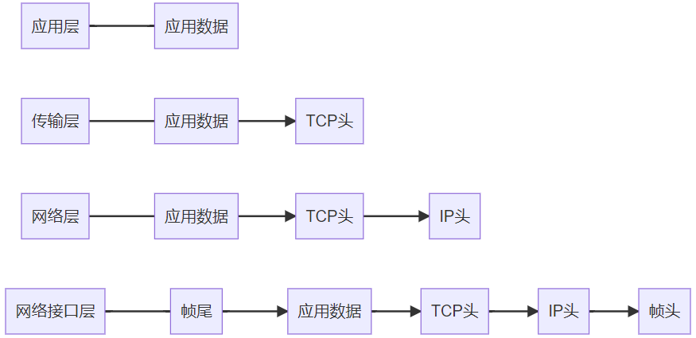

# CN

## 概述

1. 计算机网络是由若干**结点**和连接这些结点的**链路**组成的。从组成部分上看，一个完整的计算机网路主要由**硬件**，**软件**，**协议**三大部分组成；从工作方式上看，可分为**边缘部分**和**核心部分**。
2. **边缘部分**由各主机构成，用户直接进行信息处理和信息共享，低俗连入核心网。
3. **核心部分**由路由器联网，负责为边缘部分提供高速远程分组交换。
4. 计算机网络的功能：数据通信，资源共享，分布式处理，提供可靠性，负载均衡。
5. 计算机网络的分类：按照分布范围（广域网WAN，城域网MAN，局域网LAN，个人区域网PAN/WPAN），按照传输技术分类（广播式网络，点对点网络），按照拖布结构分类（总线型，环形；（多用于局域网），星型，网状型），按照使用者分类（公用网，专用网），按照交换技术分类（电路交换网络，报文交换网络，分组交换网络）
6. 网络通过**路由器**互联起来，构成了一个覆盖更大的计算机网络，称为**互联网**
7. **ISP** 互联网服务提供商
8. 根据TCP/IP模型可以分为网络接口层，网络层，传输层和应用层。
9.

    <figure><figcaption></figcaption></figure>

## 物理层

## 数据链路层

1. MAC地址，封装成数据帧，发送到网络，主要为网络层提供链路级别传输的服务，负责在以太网，WiFi这样的底层网络上发送原始数据包，工作在网卡这个层次，使用MAC地址来标识网络上的设备。

## 网络层

1. 实现设备到设备的传输，最常使用的是IP协议，将传输层的报文作为数据部分，加上IP包头组装成IP报文，超过MTU最大传输单元进行分片。
2. IP协议的重要能力，寻址和路由，寻址是告诉前往下一个目的地朝哪个方向走，路由则是根据下一个目的地选择路径。
3. ICMP的工作过程，ping，ping 127.0.0.1 检查本地的TCP/IP协议有没有配置好；ping 本机ip地址，检查本机ip地址是否设置有误，网卡配置是否正确；ping本网网关或者本网ip地址，检查硬件设备是否有问题，检查本机与本地网络是否连接正常；ping 远程ip地址值，检查本网或本机与外部链接是否正常。（通过ipconfig找到自己主机的ip地址和默认网关）
4. IP报文头部格式（版本，首部长度，服务类型TOS，总长度，标识，标志，片位移，TTL，协议，首部校验和，源IP地址，目标IP地址）。

## 传输层

1. TCP，传输控制协议，大部分应用使用的都是TCP，比如HTTP应用层协议，TCP比UDP多了流量控制，超时重传，拥塞控制等保证数据包可靠传输给对方的特性。
2. UDP，只负责发送数据包，不保证能否抵达，实时性好，传输效率高。
3. 传输层把数据包传给应用，应用到应用的通信，一台设备上对接的应用是以**端口**这个编号来进行区分，80端口通常是web服务器，22端口通常是登录远程服务器。
4. TCP报文头部的格式，源端口号，目标端口号，序号，确认号（URG，ACK，PSH，RST，SYN，FIN），状态位，窗口大小（流量控制和拥塞控制），校验和。
5. TCP传输数据前，需要先三次握手建立连接，客户端主动发起连接，服务器手段返回SYN，并且ACK客户端的SYN，客户端受到服务器的SYN和SCK，发送对SYN确认的ACK，然后连接建立，服务器受到ACK的ACK后，连接建立，一发一收。
6.  **三次握手**

    1. client通过server发送一个`SYN` 来创建一个主动打开，client把这段链接的序号设定为随机数`A`。
    2. server为一个合法的`SYN`会送一个`SYN/ACK`，`ACK`的确认码应该是 `A+1` ，`SYN/ACK` 本身又会有一个新的随机序号 `B`.
    3. client再发送一个ACK，当服务器收到这个ACK，就完成了，进行连接创建，此时包序号设定为收到的确认号A+1，而响应为B+1

    #### &#x20;四次握手

    1. client发送一个数据分段，其中的FIN标记设置为1，client进入FIN-wait状态，该状态下客户端只接收数据，不再发送
    2. server收到带有FIN=1的数据分段，发送带有ACK=1的剩余数据分段，确认收到来自client的信息。
    3. server等到所有的数据传输结束，向client发送一个fin=1的数据分段，进图CLOSE-WAIT状态
    4. 客户端收到fin=1,返回ACK=1,进图TIME-WAIT状态，服务器收到后关闭连接，客户端等待2msl则认为成功关闭。

## 会话层

## 表示层

## 应用层

1. 应用层专注于为用户提供应用功能，比如HTTP（基于TCP传输）, FTP, Telnet, DNS, SMTP等。
2. 键入网址到网页显示，期间发生了什么？
   1. 首先进行URL解析，浏览器会对URL进行解析，从而生成发送给Web服务器的HTTP请求信息，在URL中包括HTTP/HTTPS，表示访问数据的协议，接着是服务器的名称，数据源/文件的路径名，对URL解析之后，浏览器确定了web服务器和文件名，根据这些信息生成HTTP请求信息。（GET和POST）。
   2. 接着是地址解析，DNS完成地址查询，查询服务器域名对应的IP地址，DNS解析完成后会得到对应服务器的IP地址，解析的过程就是**只指路不带路**，同时，如果有DNS缓存，就会直接返回IP地址，先问浏览器，再问操作系统，再去Host文件，最后都没有就本地DNS服务器。
   3. 通过DNS获得IP之后，就可以把HTTP的传输工作交给操作系统中的协议栈，包括TCP、UDP、以及IP协议里的ICMP和ARP等协议。浏览器会调用Socket库委托协议栈完成工作，协议栈上半部分，负责收发数据的TCP/UDP协议，他们接受应用层的委托执行收发数据的操作；下半部分是用IP协议控制网络包在互联网上传输局，把数据分成一块块的网络包，IP就负责把网络包发送给对方，同时IP协议中ICMP（互联网控制消息协议，错误侦测和回馈机制，ping）用于告知网络包传输过程中的错误以及各种控制信息，ARP（地址解析协议，用来将IP地址解析成MAC地址）用来根据IP地址查询相应的以太网MAC地址，加上TCP头部数据，IP头部数据的数据包后还要加上MAC头部。
   4. 此时的网络数据包包含了以上多层的头部信息后，只是存放在内存中的一串二进制数字信息，要把数字信息转成电信号，才能在网线上传输，负责执行的是网卡，网卡将包转为电信号，通过网线发送出去。
   5. 然后交换机根据Mac地址表查找Mac地址，将信号发送给相应的端口。
   6. 网络包经过交换机后，到达路由器，在此被转发到下一个路由器或者目标设备，路由器是基于IP设计的，各个端口都有MAC地址和IP地址，而交换机是基于以太网设计的，不具有MAC地址，数据包通过多个路由器的帮助，抵达目的地。
   7. 数据包抵达服务器之后，服务器分析Mac头部，ip头，TCP头，然后服务器里的HTTP进程看到这个请求是要访问一个页面，于是将这个页面封装在HTTP响应报文里，然后也穿上TCP、IP、MAC头部，不过这个目标地址是客户端ip地址。
   8. 客户端也一步一步扒开头部，受到HTTP响应报文，交给浏览器去渲染，最后客户端要离开，向服务器发起了4次挥手，连接断开。
