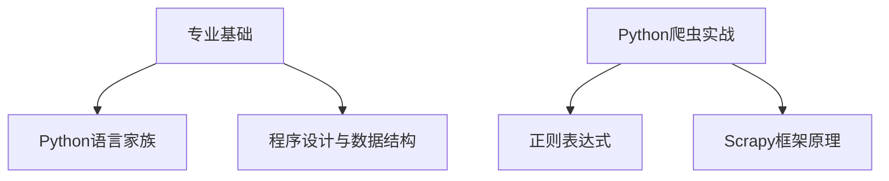
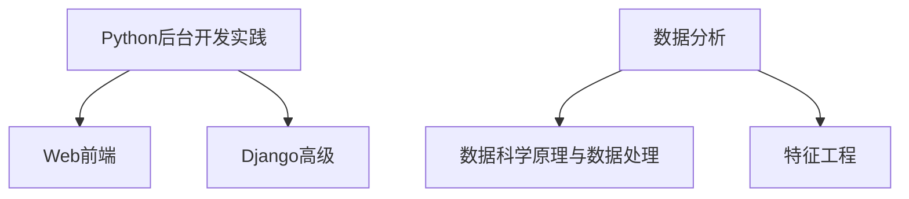
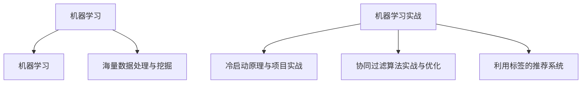

# 专业基础

\[toc]

### Python语言

#### 基础语法

**注释**

1. 单行注释`#`开头
2. 多行注释使用三个`'''`或者三个双引号

**缩进**

1. 最后一行语句缩进的空格数不一致，会导致运行错误

**输入和输出**

1. input() 输入，小括号中是提示信息，用来在获取数据之前给用户的一个简单提示；从键盘获取了数据之后，会存放到等号右边的变量之中；输入的任何值都可以作为字符串对待。
2. print() 输出，一般需要换行，如果不换行，就要在变量末尾加上`end="":`

#### 数据类型

python有六个标准的数据类型，**number**数字（支持int整型，float浮点型，bool布尔型，complex复数），**string**字符串，**tuple**元组（写在`()`里面，与list的区别就是元组不可以修改），**list**列表，**set**集合，**dict**字典，其中前面三个，数字，字符串和元组属于不可变数据，而后面三个，列表，集合和字典属于可变数据。

**集合**

1. Set，是一个无序不重复元素的序列
2. 可以使用大括号`{}`或者`set()`函数创建集合，但是创建空集合必须用`set()`，因为用`{}`创建的是空字典
3. 集合之间可以进行：`-`差集，`&`交集，`|`并集，`^`反交集

**字典**

1. 字典是一种映射类型，字典用`{}`标识，它是一个无序的键(key): 值(value)对集合
2. 键(key)必须使用不可变类型，在同一个字典中，键(key)必须是唯一的

**数据类型转换**

1. 自动数据类型转换/隐式转换
2. 强制类型转换/显式转换：int() 将其他类型转为整形；float() 将其他类型转为浮点型；complex() 复数; bool() 布尔; str() 字符串; list() 列表; set() 集合; dict() 字典

#### 循环结构

**break和continue**

1. break：在循环中break的作用是终止当前循环结构的后续操作，一旦程序运行了break，循环就终止了
2. continue：用来告诉python跳过当前循环块中的剩余语句，然后进行下一轮循环

**while和break**

1. while循环，只要条件满足，就不断循环，条件不满足时退出
2. 在循环中，break可以提前退出循环

**while和continue**

1. 循环过程中，也可以通过continue语句，跳过当前的这次循环，直接开始下一次的循环

**for循环**

1. for循环可以遍历任何可迭代对象，如一个列表或者一个字符串
2. 使用`range`函数，`range(start, stop, step)`, `for i in range(len(x))`

#### 函数

**作用**

1. 提升代码的重复利用率，避免重复开发相同代码
2. 提高程序开发效率
3. 便于程序维护

**命名**

1. 可使用英文或者拼音，中文不允许
2. 可用数字，但不能用在开头
3. 特殊字符只能用下划线`_`
4. 区分大小写
5. 必须有意义
6. 不能和系统已存在的保留关键字冲突
7. 禁止使用和系统提供函数相同的函数名

**局部变量和全局变量**

1. 局部变量只能在其被声明的函数内部访问，而全局变量可以在整个程序范围内访问。调用函数时，所有在函数内声明的变量名称都将加入到作用域中。

**返回值**

1. 类型
2. return的特征：1. 可以为当前函数执行完毕返回一个结果，2. 执行之后，函数则会终止， 3. 一个函数可以书写多个return语句，但是一般会放入分支结构中，4. 一个函数若要返回多个数据，可借助符合数据类型，列表，元组，集合，字典等。

#### 文件读写

**读写函数**

1. `read()`读取文件
2. `readline()`读取一行文件
3. `readlines()`将文件中的内容读取到序列中
4. `write()`写入文件
5. `writelines()`将序列写入文件中
6. `truncate()`字符串截取操作

**内置文件读写操作**

1. `open()`打开或者创建一个文件
2. `wrax`不可以互相组合
3. `close()`关闭文件

#### 数据类型操作

**String字符串**

1. 格式化输出

**list列表**

序列是Python中最基本的数据结构。序列中的每个元素都分配一个数字，它的位置，或索引，第一个索引都是0。

1. 脚本操作符，列表对`+`和`*`的操作符与字符串相似，`+`用于组合列表，`*`用于重复列表
2. 截取与拼接，使用嵌套列表，即在列表里创建其他列表

**字典**

1. 字典是另一种可变容器模型，且可存储任意数据类型
2. 键必须是唯一的，值不是。

**set集合**

1. 集合是一个无序不重复元素的序列
2. 基本功能是进行成员关系测试和删除重复元素
3. 创建，可以使用大括号`{}`或者`set()`函数创建集合，但是创建空集合必须用`set()`，因为用`{}`创建的是空字典
4. 序列函数：`min()`, `max()`, `len()`, `set()`创建一个空集合或者将其他数据类型转为集合
5. 方法：remove-移除指定集合元素，update-更新已有集合，add-增加集合元素，difference-求差集，copy-浅拷贝，clear-清空集合元素，discard-移除元素，difference\_update-删除当前set中的所有包含在new set里的元素，union-并集，创建新的对象，pop-移除集合元素，issuperset-判断是否是父集，intersection\_update-取交集，更新原来的集合，intersection-取交集，建立新的集合，symmetric\_difference-去两个集合的差集，建立新的集合对象，issubset-判断是否是子集，isdisjoint-判断没有交集，返回T/F，symmetric\_difference\_update-去两个集合的差集，更新原来的集合

### 程序设计与数据结构

#### 对象

**面向对象编程**

1. 对象包含属性和方法
2. 面向过程编程为：函数的调用集合
3. 面向对象：对象之间传递信息的集合

**访问限制**

1. 通过两个下划线可以修改私有变量
2. 通过编写get和set方法来修改对象的属性

**类和实例**

1. 类可以理解为图纸或者模板
2. 实例是根据类的图纸或者模板创建出来的一个个对象
3. 面向对象的三大特点: 继承，封装，多态

#### 继承

1. 被继承的类称为基类/父类/或者超类
2. 多继承，需要注意圆括号内父类的顺序，从左至右搜索。

#### MySQL数据库

1. 数据的DML操作
2. 多表联查
